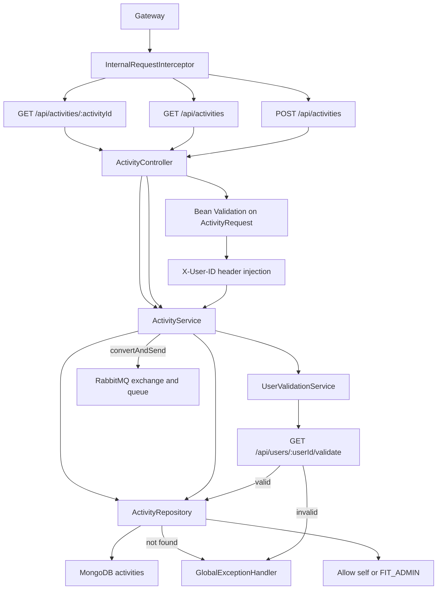
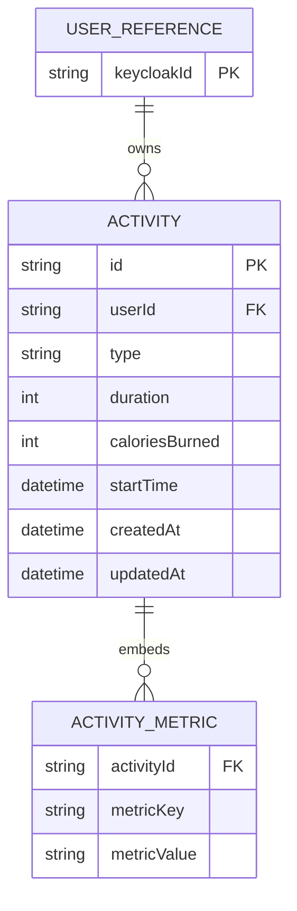

# Activity Service Architecture

The activity service validates the effective user, persists workout activity documents, and publishes activity events for asynchronous AI processing.

## Runtime Flow

## ER Diagram

`additionalMetrics` is stored as a `Map<String, Object>` inside the MongoDB activity document. The child entity below is a logical view of that embedded map.

