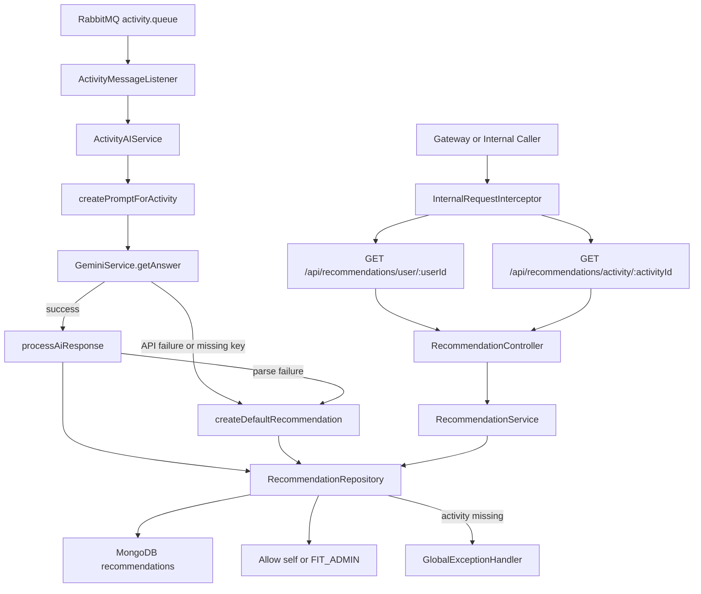
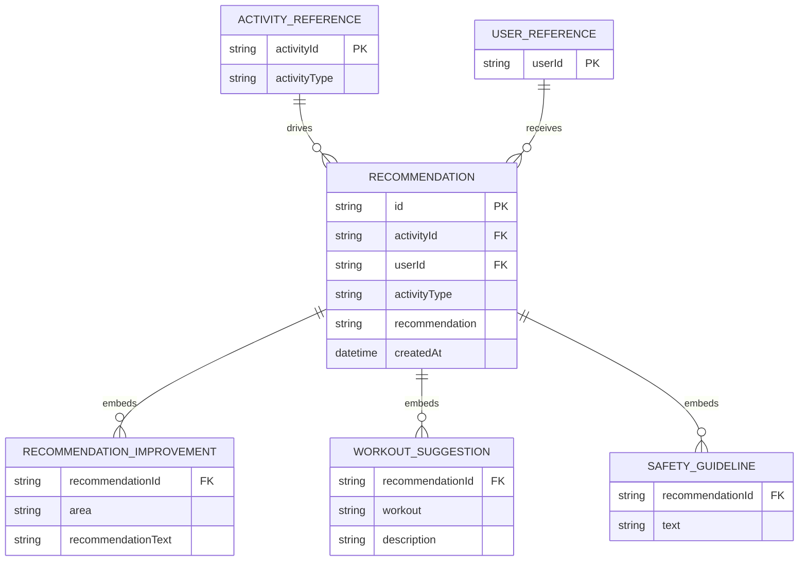

# AI Service Architecture

The AI service consumes activity events, calls Gemini, normalizes the response, and exposes recommendation lookup endpoints.

## Runtime Flow

## ER Diagram

The recommendation document stores lists for `improvements`, `suggestions`, and `safety`. The child entities below are logical views of those embedded arrays.

