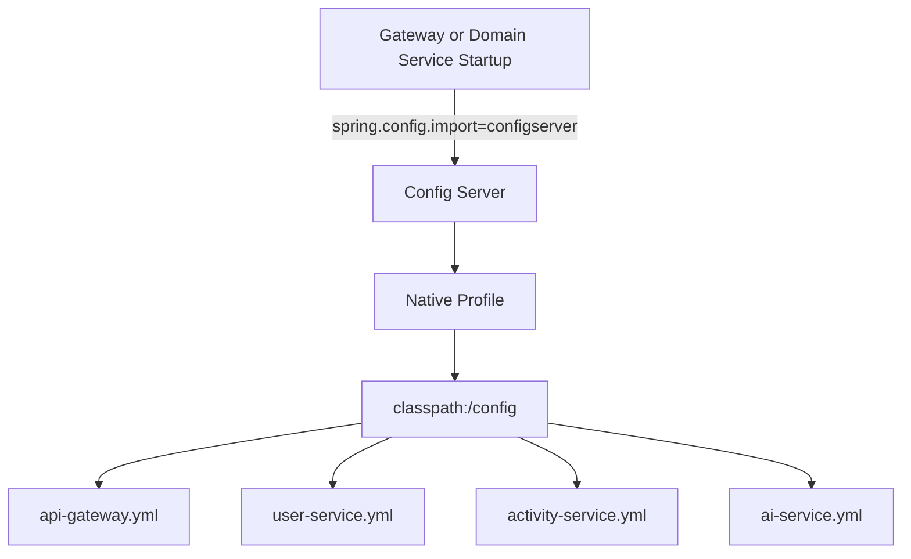

# Config Server Architecture

The config server serves classpath-backed configuration files to the runtime services during startup.

## Runtime Flow

## Logical ER Diagram

The config server does not persist relational data. This ER diagram models the configuration documents it serves.

