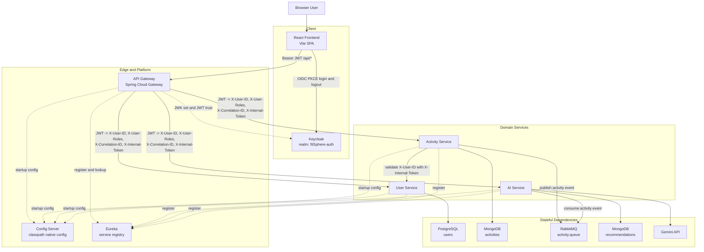
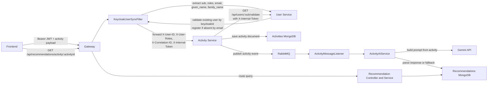
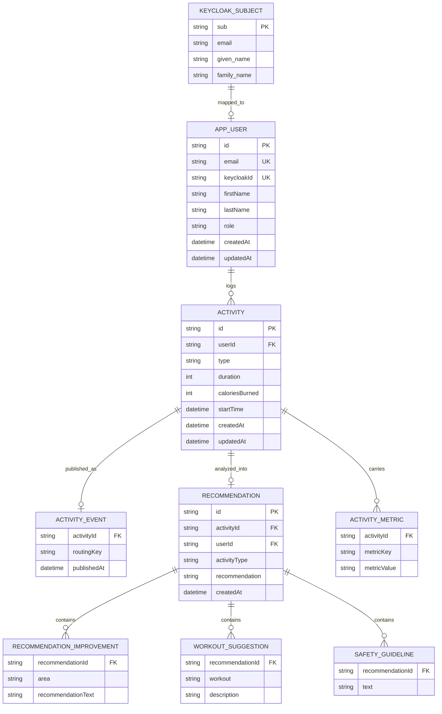

# FitSphere System Architecture

This document is the source of truth for the platform-level runtime topology and cross-service data model.

## Runtime Topology

## Detailed Request and Event Path

## Whole-System ER Diagram

This is a logical cross-store ER view. For MongoDB documents and list fields, child entities below represent embedded or repeated structures rather than separate physical tables.

