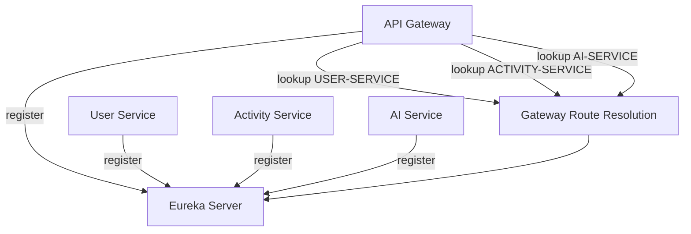
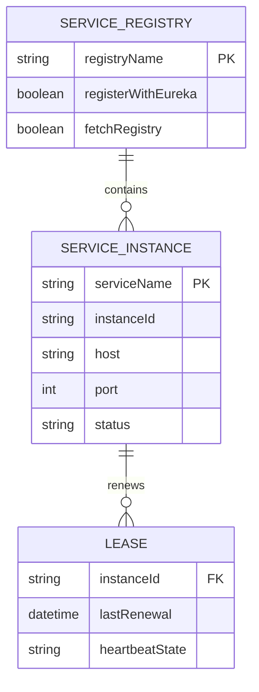

# Eureka Architecture

Eureka is the service registry used by the gateway and domain services for discovery.

## Runtime Flow

## Logical ER Diagram

The registry is in-memory service-discovery state rather than an application database.

