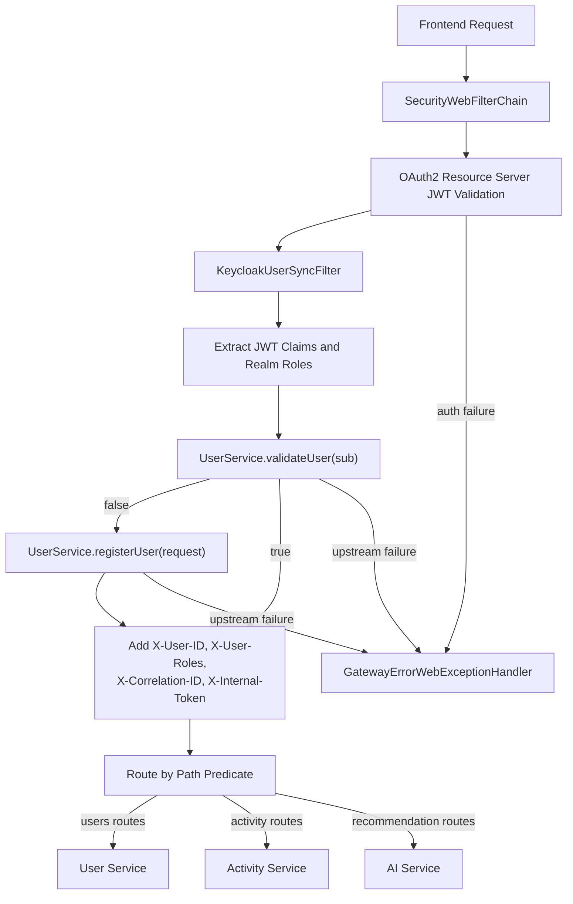
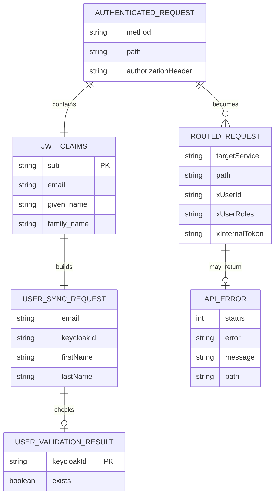

# Gateway Architecture

The gateway is the authenticated edge for all backend traffic. It validates JWTs, synchronizes the effective user identity, and routes requests to downstream services.

## Runtime Flow

## Logical ER Diagram

The gateway has no persistent database. This ER diagram shows the request and identity objects it constructs and forwards.

