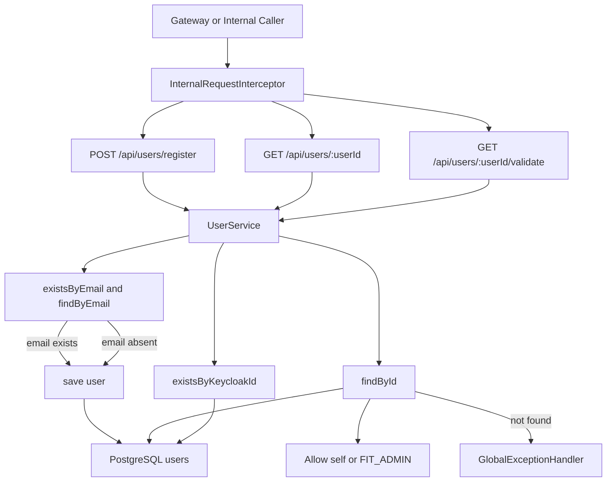
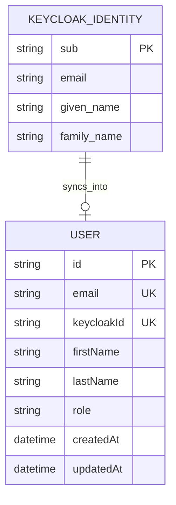

# User Service Architecture

The user service owns application user persistence. It is the bridge between Keycloak identities and internal user records.

## Runtime Flow

```mermaid
flowchart TB
    gateway["Gateway or Internal Caller"]
    register["POST /api/users/register"]
    getprofile["GET /api/users/:userId"]
    validate["GET /api/users/:userId/validate"]
    internalauth["InternalRequestInterceptor"]
    service["UserService"]
    byemail["existsByEmail and findByEmail"]
    saveuser["save user"]
    byid["findById"]
    ownership["Allow self or FIT_ADMIN"]
    bykeycloak["existsByKeycloakId"]
    postgres["PostgreSQL users"]
    error["GlobalExceptionHandler"]

    gateway --> internalauth
    internalauth --> register
    internalauth --> getprofile
    internalauth --> validate

    register --> service
    service --> byemail
    byemail -->|email exists| saveuser
    byemail -->|email absent| saveuser
    saveuser --> postgres

    getprofile --> service
    service --> byid
    byid --> postgres
    byid --> ownership

    validate --> service
    service --> bykeycloak
    bykeycloak --> postgres

    byid -->|not found| error
```

## ER Diagram

```mermaid
erDiagram
    KEYCLOAK_IDENTITY ||--o| USER : syncs_into

    KEYCLOAK_IDENTITY {
        string sub PK
        string email
        string given_name
        string family_name
    }

    USER {
        string id PK
        string email UK
        string keycloakId UK
        string firstName
        string lastName
        string role
        datetime createdAt
        datetime updatedAt
    }
```
